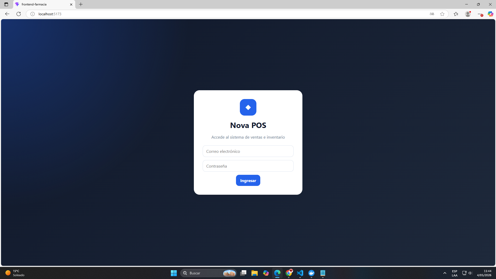

# 📦 Backend – Sistema de Inventario y Ventas

## 🏥 Botica Nova Salud

---

## 📌 Descripción

Este backend forma parte del sistema web de gestión de inventario y ventas para la botica **Nova Salud**.

Está desarrollado con **Node.js + Express**, implementando una **API REST** que permite la comunicación con un frontend en React.
La información se almacena en una base de datos **MySQL en la nube (Aiven)**, garantizando persistencia, disponibilidad y escalabilidad.

El sistema permite:

* Gestión completa de productos
* Registro de ventas tipo POS
* Control automático de stock
* Generación de alertas
* Administración de usuarios con roles

---

## 🏗️ Arquitectura

```
Frontend (React)
        ↓ HTTP
API REST (Node.js + Express)
        ↓
Base de datos MySQL (Aiven Cloud)
```

✔ Arquitectura desacoplada
✔ Comunicación mediante JSON
✔ Separación de responsabilidades

---

## ⚙️ Tecnologías

* Node.js
* Express.js
* MySQL (mysql2)
* JSON Web Token (JWT)
* bcryptjs
* dotenv
* Docker

---

## 📁 Estructura del proyecto

```
backend-farmacia/
│
├── src/
│   ├── config/
│   │   ├── db.js
│   │   ├── initDB.js
│   │   ├── upgradePOS.js
│   │
│   ├── controllers/
│   │   ├── authController.js
│   │   ├── productoController.js
│   │   ├── ventaController.js
│   │   ├── alertaController.js
│   │   ├── dashboardController.js
│   │   ├── usuarioController.js
│   │
│   ├── routes/
│   │   ├── authRoutes.js
│   │   ├── productoRoutes.js
│   │   ├── ventaRoutes.js
│   │   ├── alertaRoutes.js
│   │   ├── dashboardRoutes.js
│   │   ├── usuarioRoutes.js
│   │
│   ├── middlewares/
│   │   ├── authMiddleware.js
│   │
│   ├── utils/
│   │   ├── validaciones.js
│
├── .env
├── Dockerfile
├── package.json
└── server.js
```

---

## 🔐 Autenticación y Seguridad

El sistema utiliza **JWT** para autenticación.

### Login

```json
POST /api/auth/login

{
  "email": "admin@nova.com",
  "password": "admin123"
}
```

### Roles

**Admin**

* Gestión de productos
* Gestión de usuarios
* Acceso a reportes

**Vendedor**

* Registro de ventas
* Consulta de productos
* Visualización de alertas

---

## 📦 Módulo Inventario

### Endpoints

```
GET    /api/productos
POST   /api/productos
PUT    /api/productos/:id
DELETE /api/productos/:id
GET    /api/productos/buscar?texto=
```

### Funcionalidades

* Registro y edición de productos
* Control de stock en tiempo real
* Stock mínimo configurable
* Código de barras
* Fecha de vencimiento

---

## 💰 Módulo Ventas (POS)

### Endpoints

```
POST /api/ventas
GET  /api/ventas
GET  /api/ventas/:id
```

### Ejemplo de venta

```json
{
  "tipo_comprobante": "boleta",
  "metodo_pago": "yape",
  "cliente_nombre": "Cliente general",
  "cliente_documento": "00000000",
  "productos": [
    { "producto_id": 1, "cantidad": 2 }
  ]
}
```

### Funcionalidades

* Registro de ventas
* Cálculo automático de totales
* Descuento automático de stock
* Detalle de venta
* Historial de ventas

---

## 🚨 Módulo Alertas

### Endpoints

```
GET /api/alertas/stock-bajo
GET /api/alertas/vencimientos
GET /api/alertas/vencidos
GET /api/alertas/criticos
```

### Tipos de alertas

* Stock bajo
* Productos por vencer (30 días)
* Productos vencidos
* Productos críticos

---

## 📊 Dashboard

### Endpoint

```
GET /api/dashboard/resumen
```

### Información

* Total de productos
* Total de ventas
* Ingresos generados
* Productos con bajo stock
* Productos próximos a vencer

---

## 👤 Módulo Usuarios

### Endpoints

```
POST   /api/auth/register
GET    /api/usuarios
PUT    /api/usuarios/:id
DELETE /api/usuarios/:id
```

### Funcionalidades

* Registro de usuarios
* Gestión de roles (admin / vendedor)
* Edición y eliminación

---

## 🧠 Reglas de negocio

* No se puede vender sin stock suficiente
* No se permite cantidad menor o igual a cero
* Solo el admin puede gestionar productos y usuarios
* El stock se descuenta automáticamente en cada venta

---

## 🐳 Docker

### Construir imagen

```
docker build -t backend-farmacia .
```

### Ejecutar contenedor

```
docker run --name backend-farmacia-container \
-p 3001:3000 \
--env-file .env \
backend-farmacia
```

---

## ▶️ Ejecución local

```
npm install
npm run dev
```

Servidor:

```
http://localhost:3000
```

---

## 📡 Pruebas

Ejemplo en PowerShell:

```
Invoke-RestMethod -Uri "http://localhost:3001/api/ventas" `
-Headers @{ "Authorization" = "Bearer TOKEN" }
```

---

## ☁️ Base de datos en la nube

El sistema utiliza **MySQL en Aiven**, lo cual se evidencia en la configuración de conexión del backend mediante un **host remoto (no localhost)**.

Esto permite:

* Acceso desde múltiples entornos
* Alta disponibilidad
* Persistencia centralizada

---

## 🧾 Conclusión

El backend implementa correctamente:

✔ Arquitectura desacoplada
✔ API REST estructurada
✔ Gestión completa de inventario
✔ Sistema de ventas tipo POS
✔ Generación de alertas
✔ Seguridad mediante JWT y roles
✔ Persistencia en base de datos en la nube

---

## 👨‍💻 Autor

J. Samuel Quispe Mamani

Proyecto desarrollado con fines académicos – SENATI
